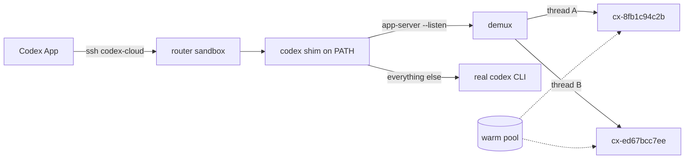

# Details

Background for the setup in [README.md](README.md).

## How the routing works

Codex App can only connect to a concrete SSH alias, and once connected it
multiplexes every thread over a single `codex app-server`. Thread identity is
invisible at the SSH layer, so there is nothing for a connection-time router to
branch on.

It is visible one layer in. Codex App starts the app-server with
`--listen unix://…`, then pipes each SSH connection into that socket with
`codex app-server proxy`. Everything a thread does crosses that socket as
JSON-RPC, and `threadId` is on about eighty of the message types. So the router
takes the listening end of the socket instead of the SSH connection.



A shim sits in front of the router's Codex CLI and hands the app-server socket
to a demux, which keeps one real app-server per worker sandbox and routes each
message to the worker its thread belongs to.

## What it routes, and what it does not

| Message | Where it goes |
| --- | --- |
| `thread/start` | the router's own app-server — a thread with no turns gets no sandbox |
| `turn/start` | a newly claimed worker, which the thread moves to for good |
| anything with a `threadId` | that thread's worker |
| `initialize` | answered by the demux; each worker gets its own handshake |
| `thread/list` | merged across every connected worker |
| `fs/*`, `command/exec`, `gitDiffToRemote` | the last thread this connection touched |

The first two rows are why a sandbox appears on your first message rather than
when you open a thread. Codex App starts a thread every time you open a project
and abandons it the moment you type, so claiming on `thread/start` bought two
sandboxes per conversation and left half of them empty. A thread that has not
run a turn has written nothing, so moving it costs only the pair of ids it then
has: the one the app was given, and the one its own worker minted. The demux
translates between them for the life of the connection.

The last row is the honest limitation. Those calls carry no thread, so the file
pane and the terminal follow whichever thread you touched most recently rather
than the one you are looking at. The protocol does not say which thread they
belong to.

Two more worth knowing:

- The app-server protocol is marked experimental. The demux forwards everything
  it does not have to understand, which keeps the exposure to thread lifecycle
  methods, but a Codex App upgrade can still change them.
- A thread started before the router existed has no binding, and its rollout
  file only exists where it ran. Those go to the router's own app-server rather
  than to a fresh sandbox that would claim to be that thread and know nothing
  about it.

## Operating it

```bash
./doctor.sh --log      # the routing log
./doctor.sh --watch    # follow it while you use the app
```

`--probe` is the useful one when something is wrong: it makes the same three
SSH calls Codex App makes, speaks the same websocket, starts a thread, and
prints which sandbox it landed on. A failure there is a failure the app would
have hit.

From inside the router sandbox, `codexctl` is the operator tool:

```bash
ssh codex-cloud '~/.codex-router/bin/codexctl status'
ssh codex-cloud '~/.codex-router/bin/codexctl threads'
ssh codex-cloud '~/.codex-router/bin/codexctl mode local'   # fall back
ssh codex-cloud '~/.codex-router/bin/codexctl reap all'     # delete workers
```

`mode local` turns the routing off: the shim stops intercepting and the router
becomes an ordinary single sandbox. It is the fallback if the demux is ever the
thing standing between you and your work.

## Working on the router

The scripts under `router/` are the source of truth. `bootstrap.sh` bakes them
into the router template, which is what a rebuilt sandbox comes up with, but
rebuilding takes minutes and loses the bindings:

```bash
./deploy.sh      # copy router/ into the running sandbox, restart the demux
./bootstrap.sh   # update the template too, for the next rebuild
```

Skills and prompts follow the same split. Codex reads them from `CODEX_HOME` on
whichever machine runs the app-server, which for a routed thread is the worker
sandbox rather than your Mac. `install.sh` puts everything on your Mac, and
`build-template.py` bakes the sandbox-safe files into the templates.

## Which OpenAI account pays

Two separate pieces of auth:

1. Local Codex App uses your signed-in Codex/ChatGPT account for local work.
2. Once connected over SSH, threads use *that sandbox's* Codex authentication.

The router signs every sandbox in from the org's `openai-api-key` secret, so
worker usage bills to the OpenAI Platform project for that key rather than your
ChatGPT subscription. Nothing interactive can happen on a worker nobody is
watching, which is why it is an API key and not a device login.

To use your own account in a sandbox instead, log the *worker template* in that
way, since each thread's sandbox is built from it:

```bash
ssh SSH_ALIAS 'codex login --device-auth'   # then open the printed link
```

Treat `~/.codex/auth.json` like a password; it contains access tokens.

## Repo layout

```text
bootstrap.sh          create the Crafting side: templates, pool, router sandbox
install.sh            write the ~/.ssh/config entry on this machine
uninstall.sh          undo install.sh
deploy.sh             push router/ into the running router sandbox
doctor.sh             check everything; --probe, --log, --watch
build-template.py     bake router/ into the Crafting templates
lib/config.sh         settings resolution, shared by all of the above
bin/probe-router      drive the router the way Codex App does
router/
  bin/codex-shim         stands in for the Codex CLI on the router
  bin/codex-demux        the app-server socket, and one worker per thread
  bin/codex-worker       claiming, resuming, and reaching workers
  bin/codex-router-init  cs login, and keeping the shim installed
  bin/codex-router-deps  find a Python that can import websockets
  bin/codexctl           operator tool, run inside the router sandbox
  lib/worker.sh          worker resolution and access
prompts/
  local/                 Mac only: needs this checkout and your cs login
    codexify.md            /codexify: make a template of yours codex-ready
    cr-set-template.md     /cr-set-template: change the router's worker template
  anywhere/              also baked into the sandbox templates
    cs-new.md              /cs-new: new chat, and so a new sandbox
    cs-task.md             /cs-task: hand work to a Crafting LLM task
    cs-status.md           /cs-status: how that task is going
    cs-sandbox.md          /cs-sandbox: which sandbox this thread is in
    cs-templates.md        /cs-templates: what you can build from
skills/crafting-sandbox/
  SKILL.md                  also baked into the sandbox templates
  references/cs-cli.md      also baked in
  references/one-sandbox.md the pre-router flow; Mac only, deliberately
  scripts/                  the pre-router setup script
skills/codex-worker-templates/
  SKILL.md              what the router needs of a template, used by /codexify
spike/                  notes from working out how Codex App connects
```

`cs-codex-open` and `references/one-sandbox.md` are the older flow, where one
named sandbox is wired to Codex App by hand and every thread shares it. Kept
for anyone who wants it, and deliberately not baked into sandboxes.

## Development

```bash
python3 ~/.codex/skills/.system/skill-creator/scripts/quick_validate.py skills/crafting-sandbox
```
