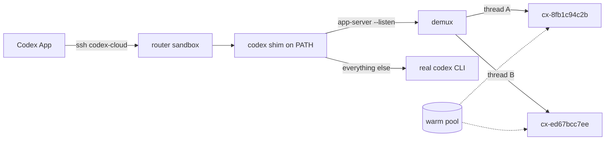

# Crafting sandboxes for Codex

Two ways to run Codex App against a Crafting sandbox, sharing one repo:

- **[A sandbox per thread](#a-sandbox-per-thread)** — one SSH connection, and every
  thread you start in Codex App lands in a fresh sandbox claimed from a warm pool.
  This is what `bootstrap.sh` and `install.sh` set up.
- **[One sandbox](#one-sandbox)** — the original flow. A skill and a `cs codex-open`
  extension that point Codex App at a sandbox you name. Still supported, and still
  the right answer when you want every thread in the same place.

Official Crafting docs are at [docs.sandboxes.cloud](https://docs.sandboxes.cloud/).

## A sandbox per thread

Codex App can only connect to a concrete SSH alias, and once connected it
multiplexes every thread over a single `codex app-server`. So thread identity is
invisible at the SSH layer — there is nothing for a connection-time router to
branch on, which is how [claude-desktop](../claude-desktop) does it.

It is visible one layer in. Codex App starts the app-server with
`--listen unix://…`, then pipes each SSH connection into that socket with
`codex app-server proxy`. Everything a thread does crosses that socket as
JSON-RPC, and `threadId` is on about eighty of the message types. So the router
takes the listening end of the socket instead of the SSH connection.



The router sandbox runs no threads of its own. A shim sits in front of its Codex
CLI and hands the app-server socket to a demux, which keeps one real app-server
per worker sandbox and routes each message to the worker its thread belongs to.

### Setup

```bash
./bootstrap.sh   # templates, worker pool, service account, router sandbox
./install.sh     # the ~/.ssh/config entry on this machine
./doctor.sh      # check all of it
```

`bootstrap.sh` needs org admin rights once, to create the service account the
router claims workers as. It also wants an OpenAI API key in an org secret named
`openai-api-key`, which is what every sandbox signs Codex in with:

```bash
cs -O YOUR_ORG secret create openai-api-key --shared -f -
```

Codex App owns the last step, as it does for any SSH remote:

```text
Settings -> Connections -> SSH -> Add
  Display name: codex-cloud
  Target mode:  Alias
  Alias:        codex-cloud
  Auth mode:    No Auth
```

Enable it, pick the remote project folder `install.sh` printed, and start a
thread. It claims its own sandbox, named `cx-` plus a digest of the thread id.

### Checking on it

```bash
./doctor.sh              # every piece, and what to do about the broken ones
./doctor.sh --probe      # drive the router the way Codex App does
./doctor.sh --log        # the routing log
./doctor.sh --watch      # follow it while you use the app
```

`--probe` is the useful one when something is wrong: it makes the same three SSH
calls Codex App makes, speaks the same websocket, starts a thread, and prints
which sandbox it landed on. A failure there is a failure the app would have hit.

From inside the router sandbox, `codexctl` is the operator tool:

```bash
ssh codex-cloud '~/.codex-router/bin/codexctl status'
ssh codex-cloud '~/.codex-router/bin/codexctl threads'
ssh codex-cloud '~/.codex-router/bin/codexctl mode local'   # fall back
ssh codex-cloud '~/.codex-router/bin/codexctl reap all'     # delete workers
```

`mode local` turns the routing off: the shim stops intercepting and the router
becomes an ordinary single sandbox. It is the fallback if the demux is ever the
thing standing between you and your work.

### Working on the router

The scripts under `router/` are the source of truth. `bootstrap.sh` bakes them
into the router template, which is what a rebuilt sandbox comes up with, but
rebuilding takes minutes and loses the bindings:

```bash
./deploy.sh        # copy router/ into the running sandbox, restart the demux
./bootstrap.sh     # update the template too, for the next rebuild
```

### What it does and does not route

| Message | Where it goes |
| --- | --- |
| `thread/start` | the router's own app-server — a thread with no turns gets no sandbox |
| `turn/start` | a newly claimed worker, which the thread moves to for good |
| anything with a `threadId` | that thread's worker |
| `initialize` | answered by the demux; each worker gets its own handshake |
| `thread/list` | merged across every connected worker |
| `fs/*`, `command/exec`, `gitDiffToRemote` | the last thread this connection touched |

The first two rows are why a sandbox appears when you send your first message
rather than when you open a thread. Codex App starts a thread every time you
open a project and abandons it the moment you type, so claiming on `thread/start`
bought two sandboxes per conversation and left half of them empty. A thread that
has not run a turn has written nothing, so moving it costs only the pair of ids
it then has: the one the app was given, and the one its own worker minted. The
demux translates between them for the life of the connection.

That last row is the honest limitation. Those calls carry no thread, so the file
pane and the terminal follow whichever thread you touched most recently rather
than the one you are looking at. `claude-cloud` documents the same trade for its
file pane, and for the same reason: the protocol does not say.

Two more worth knowing:

- The app-server protocol is marked experimental. The demux forwards everything
  it does not have to understand, which keeps the exposure to thread lifecycle
  methods, but a Codex App upgrade can still change them.
- A thread started before the router existed has no binding, and its rollout file
  only exists where it ran. Those go to the router's own app-server rather than to
  a fresh sandbox that would claim to be that thread and know nothing about it.

### Skills and slash commands

Codex reads skills and custom prompts from `CODEX_HOME` on whichever machine
runs its app-server, which for a routed thread is the worker sandbox and not
your Mac. So there are two sets.

Local only, because they need this checkout and your own `cs` login:

- `/codexify SOURCE [NEW_NAME]` — copy one of your Crafting templates and add
  what the router needs of a worker (the Codex CLI installed and signed in on
  create), optionally with a warm pool.
- `/cr-set-template TEMPLATE` — point the router at a different worker
  template. New threads build from it; existing threads keep their sandboxes.

Anywhere, including inside a thread's own sandbox, where `cs` is already
authenticated as the router's service account:

- `/cs-new` — start a new chat, which lands in a fresh sandbox on its first
  message.
- `/cs-task WHAT TO BUILD` — hand the work to a Crafting LLM task running in
  the background.
- `/cs-status [NAME]` — how that task is going.
- `/cs-sandbox` — which sandbox this thread is in.
- `/cs-templates` — what you can build sandboxes from.

The `crafting-sandbox` skill covers the same ground in plain language, which is
what voice mode actually uses: "spin up a new Crafting sandbox", "what sandbox
am I in", "build X as a task", "how's that task going". `install.sh` puts the
skills and both prompt sets on your Mac, and `build-template.py` bakes the
sandbox-safe ones into the router and worker templates.

The skill's first rule is that a new Crafting sandbox means a new thread in the
**Crafting Sandbox** workspace on the `codex-cloud` connection — never `cs sb
create`, which would make a sandbox no thread is attached to and the router
knows nothing about. Name your Codex workspace **Crafting Sandbox** and point
it at this connection for that to work. The older flow, where you wire one
named sandbox to Codex App by hand, is kept out of the way in
`skills/crafting-sandbox/references/one-sandbox.md` and is not baked into
sandboxes, so a thread cannot mistake it for the current convention.

### Teardown

```bash
./uninstall.sh          # just this machine
./uninstall.sh --all    # and the router sandbox and its workers
./bootstrap.sh --destroy-all   # and the templates, pool, secret, service account
```

## One sandbox

The original flow: a Codex skill and a `cs` extension that point Codex App at a
sandbox you name. Every thread runs in that one sandbox.

It teaches Codex how to:

- List and inspect Crafting templates.
- Create, show, wait for, resume, and inspect sandboxes.
- Execute commands inside sandbox workloads.
- Prepare a Crafting sandbox as a Codex App SSH remote environment.
- Install a `cs codex-open` extension for opening manually-created sandboxes.

### Install / use with Codex

Open Codex and type:

```text
Use this repo to set up a new sandbox with an empty workspace:
https://github.com/crafting-demo/crafting-codex
```

Codex should fetch this repo, read `skills/crafting-sandbox/SKILL.md`, use the
bundled setup script, create the Crafting sandbox, and prepare it for use as a
Codex App SSH remote environment.

The setup script writes a working SSH alias and verifies the remote Codex CLI,
but Codex App may not automatically show newly written SSH aliases. If the
connection does not appear in **Settings -> Connections -> SSH**, add it manually:

```text
Settings -> Connections -> SSH -> Add
Display name: SSH_ALIAS
Target mode: Alias
Alias: SSH_ALIAS
Auth mode: No Auth
```

Then enable the connection and choose the remote project folder reported by the
setup output.

For a manual local install, copy or symlink the skill directory into your Codex
skills folder:

```bash
mkdir -p ~/.codex/skills
cp -R skills/crafting-sandbox ~/.codex/skills/
```

### Install as a `cs` extension

Crafting's CLI can install git repositories that contain executables named
`cs-FOO`. This repo includes `cs-codex-open`, so after installing it you can run
`cs codex-open ...`.

```bash
cs extensions install https://github.com/crafting-demo/crafting-codex
```

To refresh an existing install:

```bash
cs extensions uninstall https://github.com/crafting-demo/crafting-codex || true
cs extensions install https://github.com/crafting-demo/crafting-codex
```

Then open a manually-created sandbox/workspace in Codex. Folder-scoped sandbox
names such as `FOLDER/SANDBOX` are resolved before treating a slash as
`SANDBOX/WORKLOAD`.

```bash
cs codex-open SANDBOX/WORKLOAD
cs codex-open SANDBOX/WORKLOAD SSH_ALIAS
cs codex-open SANDBOX --workload WORKLOAD --project-dir REMOTE_PROJECT_DIR
cs codex-open SANDBOX/WORKLOAD --ssh-host WORKLOAD_SSH_HOST
cs codex-open SANDBOX/WORKLOAD --no-install-codex
```

The extension:

1. Reuses `skills/crafting-sandbox/scripts/setup-crafting-codex-remote.sh`.
2. Creates or updates a concrete SSH alias in `~/.ssh/config`.
3. Verifies SSH and remote `codex app-server` readiness.
4. Uses an existing remote `codex` command, or installs Node.js, npm, and
   `@openai/codex` by default when `codex` is missing.
5. Removes the previous `cs codex` shim if it was created by an older version.
6. Opens Codex Desktop with `codex app`.

Codex Desktop still owns the supported final registration step. The extension
writes the SSH alias so it appears in the app's **Add SSH Connection** list, but
the app must add/enable the connection and choose the remote project folder from
**Settings -> Connections -> SSH**.

### Remote setup script

```bash
skills/crafting-sandbox/scripts/setup-crafting-codex-remote.sh SANDBOX_NAME [SSH_ALIAS]
CODEX_CRAFTING_ORG=ORG skills/crafting-sandbox/scripts/setup-crafting-codex-remote.sh FOLDER/SANDBOX SSH_ALIAS
```

The script:

1. Uses `cs sb show` to discover the workload SSH host.
2. Writes a concrete SSH alias to `~/.ssh/config`.
3. Verifies `ssh ALIAS`.
4. Checks whether remote `codex` is installed.
5. Offers to install Node.js, npm, and `@openai/codex` when missing.
6. Logs remote Codex in from `OPENAI_API_KEY`, `CODEX_ACCESS_TOKEN`, or common
   Crafting secret paths.
7. Runs `codex doctor --summary --ascii`.

The script does not write Codex App's private local UI storage. The final
connection registration, enable toggle, and project-folder selection happen in
Codex App.

## Which OpenAI account pays for usage?

There are two separate pieces of auth to keep straight:

1. The local Codex App uses your locally signed-in Codex/ChatGPT account while it
   is doing local work, such as helping you create a sandbox with the `cs` CLI.
2. Once Codex App connects over SSH, it starts the Codex app-server on the remote
   sandbox. Threads running there use *that sandbox's* Codex authentication.

So if a sandbox signs in with an API key, its Codex work is billed through the
OpenAI Platform project for that key, not through your ChatGPT subscription. The
per-thread router signs every sandbox in from the org's `openai-api-key` secret
for exactly that reason: nothing interactive can happen on a worker nobody is
watching.

To use your ChatGPT/Codex account in a sandbox instead:

```bash
ssh SSH_ALIAS 'codex login --device-auth'          # then open the printed link
ssh SSH_ALIAS 'mkdir -p ~/.codex && cat > ~/.codex/auth.json' < ~/.codex/auth.json
printenv CODEX_ACCESS_TOKEN | ssh SSH_ALIAS 'codex login --with-access-token'
```

Treat `~/.codex/auth.json` like a password: it contains access tokens. Your local
Codex App may keep credentials in the macOS keychain instead, in which case the
second option is not available to you.

For the router, the equivalent is to log the *worker template* in that way, since
each thread's sandbox is built from it.

## API key secret paths

The single-sandbox setup script checks these Crafting-mounted paths:

```text
/run/sandbox/fs/secrets/shared/shared/openai-key
/run/sandbox/fs/secrets/shared/shared/openai-api-key
/run/sandbox/fs/secrets/shared/shared/OPENAI-API-KEY
/run/sandbox/fs/secrets/shared/openai-key
/run/sandbox/fs/secrets/shared/openai-api-key
/run/sandbox/fs/secrets/shared/OPENAI-API-KEY
/run/sandbox/fs/secrets/openai-key
/run/sandbox/fs/secrets/openai-api-key
/run/sandbox/fs/secrets/OPENAI-API-KEY
```

The router renders the secret into the sandbox directly from the template
instead, so it does not depend on the mount layout.

## Prerequisites

- `cs` is installed and logged in on the local machine, and `jq` is available.
- The local machine has OpenSSH.
- Codex App is installed locally.
- For the per-thread router: org admin rights once, to create the service
  account, and an OpenAI API key in an org secret.

## Repo layout

```text
bootstrap.sh          create the Crafting side: templates, pool, router sandbox
install.sh            write the ~/.ssh/config entry on this machine
uninstall.sh          undo install.sh
deploy.sh             push router/ into the running router sandbox
doctor.sh             check everything; --probe, --log, --watch
build-template.py     bake router/ into the Crafting templates
lib/config.sh         settings resolution, shared by all of the above
bin/probe-router      drive the router the way Codex App does
router/
  bin/codex-shim         stands in for the Codex CLI on the router
  bin/codex-demux        the app-server socket, and one worker per thread
  bin/codex-worker       claiming, resuming, and reaching workers
  bin/codex-router-init  cs login, and keeping the shim installed
  bin/codex-router-deps  find a Python that can import websockets
  bin/codexctl           operator tool, run inside the router sandbox
  lib/worker.sh          worker resolution and access
cs-codex-open         the single-sandbox cs extension
prompts/
  local/                 Mac only: needs this checkout and your cs login
    codexify.md            /codexify: make a template of yours codex-ready
    cr-set-template.md     /cr-set-template: change the router's worker template
  anywhere/              also baked into the sandbox templates
    cs-new.md              /cs-new: new chat, and so a new sandbox
    cs-task.md             /cs-task: hand work to a Crafting LLM task
    cs-status.md           /cs-status: how that task is going
    cs-sandbox.md          /cs-sandbox: which sandbox this thread is in
    cs-templates.md        /cs-templates: what you can build from
skills/crafting-sandbox/
  SKILL.md            also baked into the sandbox templates
  agents/openai.yaml
  references/cs-cli.md      also baked in
  references/one-sandbox.md the pre-router flow; Mac only, deliberately
  scripts/setup-crafting-codex-remote.sh
skills/codex-worker-templates/
  SKILL.md            what the router needs of a template, used by the commands
spike/                notes from working out how Codex App connects
```

## Development

Validate the skill:

```bash
python3 ~/.codex/skills/.system/skill-creator/scripts/quick_validate.py skills/crafting-sandbox
```
